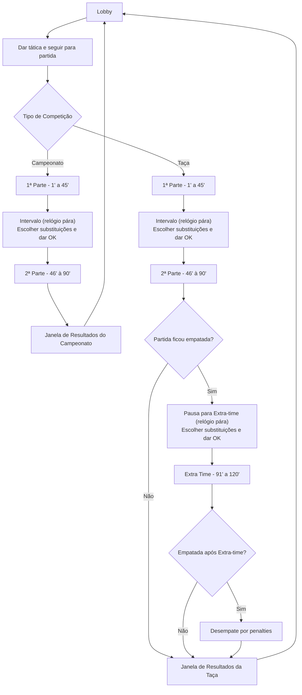

# CashBall 26/27 — Guia para Claude Code

## Visão Geral do Projecto

Jogo de gestão de futebol baseado em texto, inspirado no Elifoot 98, a correr no browser com suporte a multiplayer assíncrono. 1 a 8 treinadores humanos submetem tácticas de forma assíncrona; a simulação das partidas é síncrona (todos confirmam "Pronto" antes do início, intervalo e tempo extra). Eventos transmitidos via Socket.io em tempo real.

## Stack Tecnológica

### Frontend (`/client`)

- React 19 + Vite 8 — SPA em **JavaScript puro** (sem TypeScript)
- Tailwind CSS 4 via plugin Vite
- Socket.io-client 4
- JSDoc para type hints (sem compilação adicional)

### Backend (`/server`)

- Node.js + Express 5 em **TypeScript**
- Socket.io 4
- SQLite 3 (ficheiro local em `server/db/base.db`)
- bcryptjs, dotenv, express-rate-limit

### Infraestrutura

- Docker Compose (`docker-compose.yml` na raiz)
- Backend: porta 3000; Frontend: ip fixo `172.100.0.57` na rede `cftunnel` (externa)

## Comandos Úteis

### Backend

```bash
cd server
npm run dev          # dev com tsx (sem compilação)
npm run build        # compila TypeScript → dist/
npm run start        # corre dist/index.js
npm run typecheck    # verifica tipos sem emitir ficheiros
npm run seed         # seed da base de dados
```

### Frontend

```bash
cd client
npm run dev          # servidor de desenvolvimento Vite
npm run build        # build de produção
npm run lint         # ESLint
npm run preview      # preview do build
```

### Docker

```bash
docker compose up --build   # build e arranque dos containers
docker compose down         # parar containers
```

## Estrutura de Ficheiros

```
/
├── client/
│   ├── src/
│   │   ├── App.jsx              # componente raiz (live + tactic tabs; restantes extraídos)
│   │   ├── AdminPanel.jsx       # painel de administração
│   │   ├── socket.js            # configuração Socket.io-client
│   │   ├── countryFlags.js      # mapeamento de bandeiras
│   │   ├── main.jsx             # ponto de entrada React
│   │   ├── hooks/
│   │   │   └── useSocketListeners.js  # 40+ socket.on() extraídos do App
│   │   ├── views/               # um ficheiro por tab extraído do App
│   │   │   ├── StandingsTab.jsx
│   │   │   ├── BracketTab.jsx
│   │   │   ├── TrainingTab.jsx
│   │   │   ├── CupTab.jsx
│   │   │   ├── CalendarioTab.jsx
│   │   │   ├── ClubTab.jsx
│   │   │   ├── FinancesTab.jsx
│   │   │   ├── PlayersTab.jsx
│   │   │   └── MarketTab.jsx
│   │   ├── utils/
│   │   │   ├── audio.js         # playNotification, playGoalSound, playVarSound
│   │   │   ├── fixtures.js      # generateLeagueFixtures
│   │   │   ├── formatters.js    # formatCurrency, etc.
│   │   │   ├── playerHelpers.js # isPlayerAvailable, getFormationRequirements, etc.
│   │   │   ├── sessionHelpers.js
│   │   │   └── teamHelpers.js
│   │   └── constants/
│   │       └── index.js         # DIVISION_NAMES, TICKER_TEAM_COLORS, etc.
│   ├── public/
│   ├── index.html
│   └── vite.config.js
│
└── server/
    ├── index.ts                 # ponto de entrada Express + Socket.io
    ├── types.ts                 # tipos TypeScript globais
    ├── gameConstants.ts         # constantes do jogo (divisões, regras, etc.)
    ├── gameManager.ts           # gestão central do estado do jogo
    ├── game/
    │   └── engine.ts            # motor de simulação de partidas
    ├── socket*Handlers.ts       # handlers Socket.io por domínio:
    │   ├── socketGameplayHandlers.ts
    │   ├── socketSessionHandlers.ts
    │   ├── socketTransferHandlers.ts
    │   ├── socketFinanceHandlers.ts
    │   └── socketCupHandlers.ts
    ├── *Helpers.ts              # lógica de negócio por domínio:
    │   ├── coreHelpers.ts
    │   ├── matchFlowHelpers.ts
    │   ├── matchSummaryHelpers.ts
    │   ├── weeklyFlowHelpers.ts
    │   ├── cupHelpers.ts
    │   ├── cupFlowHelpers.ts
    │   ├── auctionHelpers.ts
    │   ├── contractHelpers.ts
    │   ├── npcTransferHelpers.ts
    │   └── presenceHelpers.ts
    ├── auth.js                  # autenticação (bcryptjs)
    ├── adminRoutes.js           # rotas de administração
    ├── db/
    │   ├── base.db              # ficheiro SQLite
    │   ├── database.js          # conexão e queries à base de dados
    │   ├── schema.sql           # esquema da base de dados
    │   ├── seed.js              # dados iniciais
    │   └── fixtures/            # fixtures para seed
    └── tsconfig.json
```

## Convenções e Decisões Arquitecturais

- **Backend em TypeScript, Frontend em JavaScript puro** — não adicionar TypeScript ao frontend
- **SQLite, não PostgreSQL** — base de dados em ficheiro local, adequada para 32 treinadores
- **Submissão assíncrona, simulação síncrona** — a jornada avança quando todos submetem; a simulação pausa no intervalo e tempo extra para confirmação
- **Divisão 5 (Distritais)** — existe apenas internamente no backend (`gameConstants.ts`) como pool de equipas IA; invisível para jogadores humanos
- **Socket.io para eventos em tempo real** — não usar polling; todos os eventos de jogo são transmitidos via WebSocket
- **auth.js mantido em JavaScript** — não converter para TypeScript sem necessidade

## Efeitos Visuais e UI

- **Paleta escura** — fundo base `#0d0d14` / `#13131f`; superfícies em `#18181f`; bordas subtis em `#26263a`
- **Acentos por posição** — GR: amarelo `#eab308`; DEF: azul `#3b82f6`; MED: verde `#10b981`; ATA: rosa `#f43f5e`
- **Dourado** — cor de destaque principal `#d4af37` / `#f0c330`; usada em leilões, preços e elementos premium
- **Persiana de leilão** — barra horizontal fixa com fundo dourado (`#92681a → #f0c330 → #92681a`), shimmer animado (`@keyframes shimmer` em `index.css`), sombra dourada; o painel expandido reverte para fundo escuro
- **Animações** — `animate-pulse` para estados ao vivo; `shimmer` (3 s, linear) para elementos premium em destaque; `toast-slide-in` para notificações
- **Sidebar adaptativa** — `sidebarCollapsed` (estado em `App.jsx`) alterna entre `w-14` e `w-64`; todos os elementos sobrepostos (persianas, overlays) devem acompanhar com `lg:left-14` / `lg:left-64`
- **Material Symbols Outlined** — biblioteca de ícones usada em todo o projecto (`className="material-symbols-outlined"`)

## Convenções de Frontend

- **Tabs do App** — cada tab é um componente em `views/`; recebe estado como props; não acede ao socket directamente (excepto `BracketTab`). Os tabs `live` e `tactic` ficam inline no `App.jsx` por serem demasiado acoplados ao estado de jogo em tempo real.
- **Socket listeners** — todos os `socket.on()` vivem em `hooks/useSocketListeners.js`; o hook recebe `(handlers, refs)` onde `handlers` contém os setters de estado e `refs` os refs React.
- **Utilitários** — lógica reutilizável em `utils/`; sem duplicação inline no App.

## Git

- Push: `git push -u origin <branch>`
- Commits em português ou inglês, descritivos e concisos

## Fluxo de decisão dos tipos de partidas


