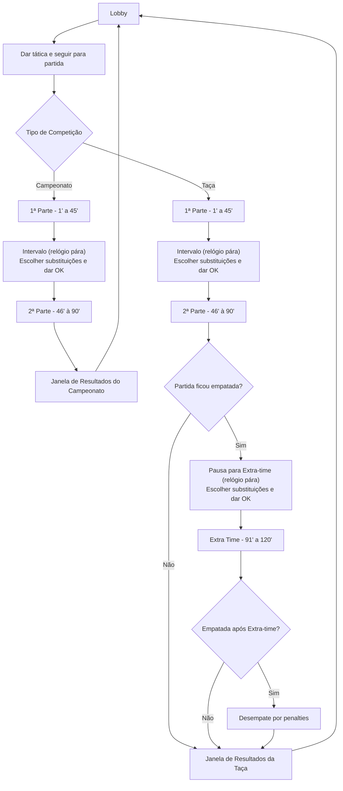

# CLAUDE.md

This file provides guidance to Claude Code (claude.ai/code) when working with code in this repository.

# CashBall 26/27 — Guia para Claude Code

## Visão Geral do Projecto

Jogo de gestão de futebol baseado em texto, inspirado no Elifoot 98, a correr no browser com suporte a multiplayer assíncrono. 1 a 8 treinadores humanos submetem tácticas de forma assíncrona; a simulação das partidas é síncrona (todos confirmam "Pronto" antes do início, intervalo e tempo extra). Eventos transmitidos via Socket.io em tempo real.

## Cache Versioning (Hard Reset)

O servidor expõe `/api/cache-version` que retorna `{ version: SERVER_START_TIME }`. O frontend em `cacheVersion.js` compara com `localStorage.cashball_cache_version`. Se diferentes, limpa todo o localStorage/sessionStorage e força reload. Isto garante que após restart do servidor, o browser não usa dados stale.

A detecção de restart via Socket.io (`serverStartTime`) também existe como fallback em `socket.js`.

## Stack Tecnológica

### Frontend (`/client`)

- React 19 + Vite 8 — SPA em **JavaScript puro** (sem TypeScript)
- Tailwind CSS 4 via plugin Vite
- Socket.io-client 4
- framer-motion — animações de transição de páginas (`PageTransition.jsx`)
- JSDoc para type hints (sem compilação adicional)

### Backend (`/server`)

- Node.js + Express 5 em **TypeScript** (strict mode desactivado — `tsconfig.json` tem `strict: false`)
- Socket.io 4
- SQLite 3 (ficheiro local em `server/db/base.db`)
- bcryptjs, dotenv, express-rate-limit

### Infraestrutura

- Docker Compose (`docker-compose.yml` na raiz)
- Backend: porta 3000; Frontend: ip fixo `172.100.0.57` na rede `cftunnel` (externa)
- `CORS_ORIGINS` env var (ou `http://localhost:5173` por omissão)

## Comandos Úteis

### Backend

```bash
cd server
npm run dev              # dev com tsx (sem compilação)
npm run build            # compila TypeScript → dist/
npm run start            # corre dist/index.js
npm run typecheck        # verifica tipos sem emitir ficheiros
npm run seed             # seed da base de dados
npm run audit:gamestate  # valida integridade do estado do jogo em memória
npm run audit:socketio   # valida contratos Socket.io entre cliente e servidor
```

### Frontend

```bash
cd client
npm run dev          # servidor de desenvolvimento Vite
npm run build        # build de produção
npm run lint         # ESLint
npm run preview      # preview do build
npm run check:types  # verificação de tipos JSDoc
```

### Docker

```bash
docker compose up --build   # build e arranque dos containers
docker compose down         # parar containers
```

## Estrutura de Ficheiros

```
/
├── client/
│   ├── src/
│   │   ├── App.jsx              # componente raiz (live + tactic tabs; restantes extraídos)
│   │   ├── socket.js            # configuração Socket.io-client
│   │   ├── countryFlags.js      # mapeamento de bandeiras
│   │   ├── main.jsx             # ponto de entrada React
│   │   ├── hooks/
│   │   │   └── useSocketListeners.js  # 40+ socket.on() extraídos do App
│   │   ├── views/               # um ficheiro por tab extraído do App
│   │   │   ├── StandingsTab.jsx
│   │   │   ├── BracketTab.jsx
│   │   │   ├── TrainingTab.jsx
│   │   │   ├── CupTab.jsx
│   │   │   ├── CalendarioTab.jsx
│   │   │   ├── ClubTab.jsx
│   │   │   ├── FinancesTab.jsx
│   │   │   ├── PlayersTab.jsx
│   │   │   └── MarketTab.jsx
│   │   ├── components/
│   │   │   ├── modals/          # sobreposições de ecrã (WelcomeModal, MatchPanel,
│   │   │   │                    #   SeasonEndModal, TransferProposalModal, JobOfferModal,
│   │   │   │                    #   DismissalModal, TeamSquadModal, PlayerHistoryModal,
│   │   │   │                    #   CupDrawPopup, PenaltyShootoutPopup,
│   │   │   │                    #   PenaltySuspensePopup, RefereePopup, etc.)
│   │   │   ├── ui/              # componentes de interface maiores (LeagueStandings,
│   │   │   │                    #   CupBracketPage, TransferHub, TrainingPage,
│   │   │   │                    #   AuctionNotification, NewsTicker, PageTransition)
│   │   │   ├── shared/          # componentes atómicos (PlayerLink, AggBadge, GameDialog)
│   │   │   └── chat/            # ChatWidget
│   │   ├── utils/
│   │   │   ├── audio.js         # playNotification, playGoalSound, playVarSound
│   │   │   ├── cacheVersion.js # verificação de cache vs. server restart
│   │   │   ├── fixtures.js      # generateLeagueFixtures
│   │   │   ├── formatters.js    # formatCurrency, etc.
│   │   │   ├── localStorage.js  # persistência de cashballSession
│   │   │   ├── playerHelpers.js # isPlayerAvailable, getFormationRequirements, etc.
│   │   │   └── teamHelpers.js
│   │   └── constants/
│   │       └── index.js         # DIVISION_NAMES, TICKER_TEAM_COLORS, etc.
│   ├── public/
│   ├── index.html
│   └── vite.config.js
│
└── server/
    ├── index.ts                 # ponto de entrada Express + Socket.io
    ├── types.ts                 # tipos TypeScript globais
    ├── gameConstants.ts         # constantes do jogo (divisões, regras, etc.)
    ├── gameManager.ts           # gestão central do estado do jogo
    ├── game/
    │   ├── engine.ts            # motor de simulação (simulateMatchSegment, ET, penalties, etc.)
    │   ├── commentary.ts        # 14 funções de narração em português (*Phrase)
    │   ├── playerUtils.ts       # Junior GRs + seleção de jogadores (withJuniorGRs, etc.)
    │   └── matchCalculations.ts # cálculos de probabilidade (getGoalTimeMultiplier, etc.)
    ├── socket*Handlers.ts       # handlers Socket.io por domínio:
    │   ├── socketGameplayHandlers.ts
    │   ├── socketSessionHandlers.ts
    │   ├── socketTransferHandlers.ts
    │   ├── socketFinanceHandlers.ts
    │   ├── socketCupHandlers.ts
    │   ├── socketTrainingHandlers.ts
    │   └── socketChatHandlers.ts
    ├── *Helpers.ts              # lógica de negócio por domínio:
    │   ├── coreHelpers.ts
    │   ├── matchFlowHelpers.ts
    │   ├── matchSummaryHelpers.ts
    │   ├── weeklyFlowHelpers.ts
    │   ├── cupHelpers.ts
    │   ├── cupFlowHelpers.ts
    │   ├── auctionHelpers.ts
    │   ├── contractHelpers.ts
    │   ├── trainingHelpers.ts
    │   ├── npcTransferHelpers.ts
    │   ├── presenceHelpers.ts
    │   └── coachDismissalHelpers.ts
    ├── auth.js                  # autenticação (bcryptjs)
    ├── adminRoutes.js           # rotas de administração
    ├── logBootstrap.js          # inicialização de logging
    ├── scripts/
    │   ├── gameStateAudit.ts    # valida integridade do ActiveGame em memória
    │   └── socketioContractValidator.ts  # valida contratos de eventos Socket.io
    ├── db/
    │   ├── base.db              # estado do jogo (por room)
    │   ├── accounts.db          # autenticação de treinadores (gerido por auth.js)
    │   ├── global_chat.db       # chat global persistente (gerido por globalDatabase.ts)
    │   ├── database.js          # conexão e queries à base de dados
    │   ├── globalDatabase.ts    # base de dados de chat global
    │   ├── init.js              # inicialização do schema
    │   ├── schema.sql           # esquema da base de dados
    │   ├── seed.js              # dados iniciais
    │   └── fixtures/            # fixtures para seed
    └── tsconfig.json
```

## Convenções e Decisões Arquitecturais

- **Ficheiros fragmentados** — preferir ficheiros pequenos e coesos a ficheiros monolíticos. Quando um ficheiro ultrapassa ~500 linhas, considerar extracção de módulos por domínio (ex: `commentary.ts`, `playerUtils.ts`). Nunca agrupar funções num ficheiro apenas por conveniência; agrupar por responsabilidade.
- **Backend em TypeScript, Frontend em JavaScript puro** — não adicionar TypeScript ao frontend
- **SQLite, não PostgreSQL** — base de dados em ficheiro local, adequada para 32 treinadores
- **Submissão assíncrona, simulação síncrona** — a jornada avança quando todos submetem; a simulação pausa no intervalo e tempo extra para confirmação
- **Divisão 5 (Distritais)** — existe apenas internamente no backend (`gameConstants.ts`) como pool de equipas IA; invisível para jogadores humanos e nunca mostrada na UI
- **Socket.io para eventos em tempo real** — não usar polling; todos os eventos de jogo são transmitidos via WebSocket
- **auth.js mantido em JavaScript** — não converter para TypeScript sem necessidade

## Máquina de Estados `gamePhase`

`ActiveGame.gamePhase` é a fonte de verdade para o estado de uma jornada. Campeonato e taça **nunca correm em simultâneo** — o calendário é linear com 19 entradas (`SEASON_CALENDAR` em `gameConstants.ts`). `game.calendarIndex` indica a posição actual; `game.matchweek` é um campo de conveniência, **não** a fonte de verdade.

Transições válidas:
```
lobby → match_first_half → match_halftime → match_second_half
  → [taça, se empatado] match_et_gate → match_extra_time
  → match_finalizing → lobby
```

Fases transitórias (`match_first_half`, `match_second_half`, `match_extra_time`, `match_finalizing`) são **repostas automaticamente para `lobby`** ao reiniciar o servidor — impede jogos permanentemente bloqueados após crash.

## Persistência do `ActiveGame` (Memória vs. DB)

O mapa `activeGames` em `gameManager.ts` é a única cópia activa de cada jogo. A sincronização com a base de dados é **selectiva, não contínua**:

- **Estado transitório** (fixtures, lineups, minuto actual durante simulação) — só em memória; gravado via `saveGameState()` em eventos específicos
- **Estado persistente** (classificações, registos de jogadores, histórico de transferências, orçamentos) — gravado na BD imediatamente após cada mutação
- **`game.lockedCoaches`** — **nunca é persistido**; os treinadores adicionam-se ao Set ao reconectarem via `assignPlayer()`. Persistir causaria bloqueios permanentes após crash
- Após restart, fases transitórias são descartadas: os treinadores precisam de se reconectar e confirmar "Pronto" novamente

## Orquestração Semanal (`checkAllReady`)

`checkAllReady()` em `weeklyFlowHelpers.ts` é o ponto central de despacho. Ao receber confirmação de todos os treinadores conectados/bloqueados:

1. Avança `calendarIndex`, aplica rendimento semanal por divisão e deduz salários
2. Gera fixtures e chama `runMatchSegment(game, 1, 45)` — segmento 1.ª parte
3. Pausa em `match_halftime`; aguarda nova confirmação
4. Chama `runMatchSegment(game, 46, 90)` — segmento 2.ª parte
5. Para taças empatadas: pausa em `match_et_gate`, depois `runMatchSegment(game, 91, 120)`
6. Penalties se necessário, depois `match_finalizing` e retorno ao `lobby`

**Guarda contra execução dupla**: `segmentRunning[game.roomCode]` booleano — verificar antes de qualquer chamada a `runMatchSegment`.

**Timeout de segurança no intervalo** (120 s): se não houver treinadores conectados, avança automaticamente. Se houver treinadores, aguarda indefinidamente — não forçar o avanço enquanto estão a ajustar substituições.

**Draw da taça**: é preparado **no fim do evento anterior** (não no início da partida de taça) — os treinadores vêem os adversários e definem tácticas no lobby antes do início.

## Fluxo de Orçamento Semanal

Por cada jornada (campeonato ou taça), em `checkAllReady()` antes da simulação:
1. Rendimento base semanal por divisão (div 1: 80k, div 2: 50k, …, div 5: 5k)
2. Dedução de salários (soma de todos os jogadores da equipa)
3. Juros de empréstimo (1,5 % do montante em dívida)
4. Receita de bilheteira (€15 por espectador — só no campeonato, após a partida)
5. Receita de patrocínio — no final da época (depende da divisão)

## Despedimento de Treinadores

`processCoachEvents()` em `coachDismissalHelpers.ts` avalia elegibilidade após cada jornada:

- **Maus resultados**: 2+ semanas consecutivas sem vitórias → avaliação de despedimento
- **Orçamento negativo**: 3+ semanas consecutivas com orçamento < 0 → despedimento obrigatório
- Campos persistidos: `dismissedCoachSince`, `negativeBudgetStreak`, `dismissalsThisSeason`

Após despedimento, a equipa fica disponível via `acceptJobOffer` / `declineJobOffer`. Se recusada por todos, a equipa joga com gestor NPC na jornada seguinte.

## Efeitos Visuais e UI

- **Paleta escura** — fundo base `#0d0d14` / `#13131f`; superfícies em `#18181f`; bordas subtis em `#26263a`
- **Acentos por posição** — GR: amarelo `#eab308`; DEF: azul `#3b82f6`; MED: verde `#10b981`; ATA: rosa `#f43f5e`
- **Dourado** — cor de destaque principal `#d4af37` / `#f0c330`; usada em leilões, preços e elementos premium
- **Persiana de leilão** — barra horizontal fixa com fundo dourado (`#92681a → #f0c330 → #92681a`), shimmer animado (`@keyframes shimmer` em `index.css`), sombra dourada; o painel expandido reverte para fundo escuro
- **Animações** — `animate-pulse` para estados ao vivo; `shimmer` (3 s, linear) para elementos premium em destaque; `toast-slide-in` para notificações
- **Sidebar adaptativa** — `sidebarCollapsed` (estado em `App.jsx`) alterna entre `w-14` e `w-64`; todos os elementos sobrepostos (persianas, overlays) devem acompanhar com `lg:left-14` / `lg:left-64`
- **Material Symbols Outlined** — biblioteca de ícones usada em todo o projecto (`className="material-symbols-outlined"`)

## Convenções de Frontend

- **Tabs do App** — cada tab é um componente em `views/`; recebe estado como props; não acede ao socket directamente (excepto `BracketTab`). Os tabs `live` e `tactic` ficam inline no `App.jsx` por serem demasiado acoplados ao estado de jogo em tempo real.
- **Socket listeners** — todos os `socket.on()` vivem em `hooks/useSocketListeners.js`; o hook recebe `(handlers, refs)` onde `handlers` contém os setters de estado e `refs` os refs React. **Atenção:** ao adicionar novos listeners que chamem `handlers.setXxx`, verificar que o setter correspondente está incluído no objecto `handlers` passado em `App.jsx` — omissões causam no-ops silenciosos.
- **Utilitários** — lógica reutilizável em `utils/`; sem duplicação inline no App.

## Convenções de Backend

- **`game/engine.ts`** exporta via `module.exports = {}` (CommonJS) para compatibilidade com o `require()` em `index.ts`; os ficheiros auxiliares do mesmo directório (`commentary.ts`, `playerUtils.ts`, `matchCalculations.ts`) usam ES module exports (`export function`). `engine.ts` re-exporta com `export { ... } from "./playerUtils"` para que os importadores externos possam usar `import { withJuniorGRs } from "./game/engine"`.
- **Narração** — todas as frases geradas durante a simulação estão em `game/commentary.ts`; não duplicar frases noutros ficheiros.
- **Factory pattern para helpers** — `createXxxHelpers(deps)` retorna um objecto com funções; `deps` inclui tipicamente `{ io, db, game }`. Exemplo: `createAuctionHelpers(deps)`, `createCupFlowHelpers(deps)`. Nunca instanciar helpers directamente; sempre passar dependências via factory. As dependências de `createWeeklyFlowHelpers` incluem: `generateFixturesForDivision`, `simulateMatchSegment`, `applyTrainingBonuses`, `startCupRound`, `finalizeCupRound`, `applySeasonEnd`, `listPlayerOnMarket`, `finalizeAuction`, `processContractExpiries`, `processCoachEvents`.
- **Registo de handlers Socket.io** — `registerXxxSocketHandlers(socket, deps)` regista todos os eventos de um domínio num único ponto; chamado dentro do `io.on("connection")` em `index.ts`. Manter eventos de domínios separados em ficheiros distintos.
- **Sincronização de fase** — `phaseToken` (UUID gerado no início de cada fase) + `phaseAcks` (Set de nomes de treinadores que confirmaram) coordenam acções multi-jogador. Um novo `phaseToken` invalida automaticamente ACKs de fases anteriores; verificar sempre se o token ainda é válido antes de avançar.
- **`lockedCoaches`** — Set em `ActiveGame` que impede acções (transferências, alterações de tácticas) enquanto a simulação está activa; verificar antes de qualquer mutação de estado de equipa.

## Git

- Push: `git push -u origin <branch>`
- Commits em português ou inglês, descritivos e concisos

## Fluxo de decisão dos tipos de partidas


