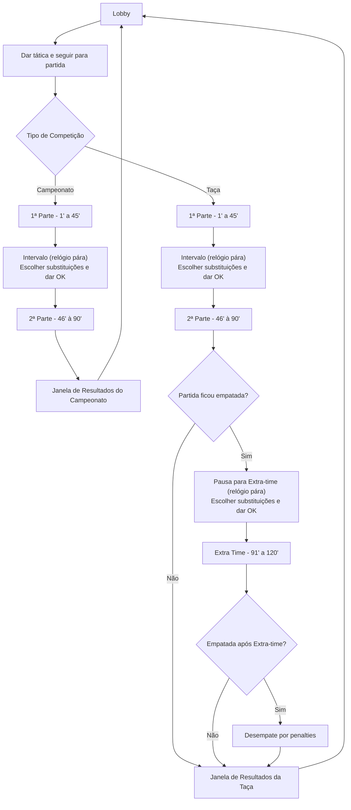

# CashBall 26/27 — Guia para Claude Code

## Visão Geral do Projecto

Jogo de gestão de futebol baseado em texto, inspirado no Elifoot 98, a correr no browser com suporte a multiplayer assíncrono. 1 a 8 treinadores humanos submetem tácticas de forma assíncrona; a simulação das partidas é síncrona (todos confirmam "Pronto" antes do início, intervalo e tempo extra). Eventos transmitidos via Socket.io em tempo real.

## Stack Tecnológica

### Frontend (`/client`)

- React 19 + Vite 8 — SPA em **JavaScript puro** (sem TypeScript)
- Tailwind CSS 4 via plugin Vite
- Socket.io-client 4
- JSDoc para type hints (sem compilação adicional)

### Backend (`/server`)

- Node.js + Express 5 em **TypeScript**
- Socket.io 4
- SQLite 3 (ficheiro local em `server/db/base.db`)
- bcryptjs, dotenv, express-rate-limit

### Infraestrutura

- Docker Compose (`docker-compose.yml` na raiz)
- Backend: porta 3000; Frontend: ip fixo `172.100.0.57` na rede `cftunnel` (externa)

## Comandos Úteis

### Backend

```bash
cd server
npm run dev          # dev com tsx (sem compilação)
npm run build        # compila TypeScript → dist/
npm run start        # corre dist/index.js
npm run typecheck    # verifica tipos sem emitir ficheiros
npm run seed         # seed da base de dados
```

### Frontend

```bash
cd client
npm run dev          # servidor de desenvolvimento Vite
npm run build        # build de produção
npm run lint         # ESLint
npm run preview      # preview do build
```

### Docker

```bash
docker compose up --build   # build e arranque dos containers
docker compose down         # parar containers
```

## Estrutura de Ficheiros

```text
/
├── client/
│   ├── src/
│   │   ├── App.jsx              # componente raiz
│   │   ├── AdminPanel.jsx       # painel de administração
│   │   ├── socket.js            # configuração Socket.io-client
│   │   ├── countryFlags.js      # mapeamento de bandeiras
│   │   └── main.jsx             # ponto de entrada React
│   ├── public/
│   ├── index.html
│   └── vite.config.js
│
└── server/
    ├── index.ts                 # ponto de entrada Express + Socket.io
    ├── types.ts                 # tipos TypeScript globais
    ├── gameConstants.ts         # constantes do jogo (divisões, regras, etc.)
    ├── gameManager.ts           # gestão central do estado do jogo
    ├── game/
    │   └── engine.ts            # motor de simulação de partidas
    ├── socket*Handlers.ts       # handlers Socket.io por domínio:
    │   ├── socketGameplayHandlers.ts
    │   ├── socketSessionHandlers.ts
    │   ├── socketTransferHandlers.ts
    │   ├── socketFinanceHandlers.ts
    │   └── socketCupHandlers.ts
    ├── *Helpers.ts              # lógica de negócio por domínio:
    │   ├── coreHelpers.ts
    │   ├── matchFlowHelpers.ts
    │   ├── matchSummaryHelpers.ts
    │   ├── weeklyFlowHelpers.ts
    │   ├── cupHelpers.ts
    │   ├── cupFlowHelpers.ts
    │   ├── auctionHelpers.ts
    │   ├── contractHelpers.ts
    │   ├── npcTransferHelpers.ts
    │   └── presenceHelpers.ts
    ├── auth.js                  # autenticação (bcryptjs)
    ├── adminRoutes.js           # rotas de administração
    ├── db/
    │   ├── base.db              # ficheiro SQLite
    │   ├── database.js          # conexão e queries à base de dados
    │   ├── schema.sql           # esquema da base de dados
    │   ├── seed.js              # dados iniciais
    │   └── fixtures/            # fixtures para seed
    └── tsconfig.json
```

## Atributos dos Jogadores

Cada jogador tem **4 atributos de skill** (escala 1–50) mais **2 atributos de condição** (escala 1–50):

| Atributo     | Coluna DB     | Posição principal | Papel no motor                           |
| ------------ | ------------- | ----------------- | ---------------------------------------- |
| Guarda-Redes | `gk`          | GR                | Contribui para `defense` da equipa       |
| Defesa       | `defesa`      | DEF               | Contribui para `defense` da equipa       |
| Passe        | `passe`       | MED               | Contribui para `midfield` (posse)        |
| Finalização  | `finalizacao` | ATA               | Contribui para `attack` da equipa        |
| Forma        | `form`        | Todos (1–50)      | Multiplicador transversal de eficácia    |
| Resistência  | `resistencia` | Todos (1–50)      | Afecta fadiga acumulada ao longo do jogo |

- O campo `skill` (legado) ainda existe na DB mas **não é usado no motor** — usar sempre os atributos individuais.
- `getOverall(player)` = média dos 4 atributos × factor de forma (0.8–1.0).
- **Craque** (`is_star = 1`) atribuído apenas a MED e ATA; triplica o peso na escolha do marcador.
- **Agressividade** (`aggressiveness`) — inteiro 1–50 na DB; o motor converte para escala 1–5 interna.

## Motor de Simulação (estilo Hattrick)

O motor (`server/game/engine.ts`) segue a mecânica do Hattrick: **posse de bola determina quem ataca**.

### `getPower(squad, tactic, morale)` — retorna `{ midfield, attack, defense, style, squad }`

```text
midfield = avgMidfielderPasse × 0.75 + avgMidfielderForm × 0.25
attack   = avgForwardFin × 0.70 + avgForwardPasse × 0.15 + avgForwardForm × 0.15
defense  = avgDefenderDef × 0.68 + avgKeeperGk × 0.32 + avgBacklineForm × 0.10
```

- Cada valor é multiplicado por factores de formação, estilo táctico e moral.
- **Médios** só contribuem para `midfield`; **Avançados** só para `attack`; **Defesas + GR** para `defense`.

### Loop minuto-a-minuto (1–90 / 91–120)

```text
homePossession = homeMidfield / (homeMidfield + awayMidfield)
teamInControl  = random() < homePossession ? "home" : "away"

if (random() < 0.14):          // 14% chance de jogada de perigo por minuto
    processChance(teamInControl)
```

### `processChance(attackingSide)` — oportunidade de golo

```text
ratio    = attack / (attack + defesa_adversária)
probGoal = ratio × 0.17 × getGoalTimeMultiplier(minute) × fator_casa (1.05/0.95)
```

- Penalidade de egos: >2 Craques no XI reduz `probGoal` em 10 pp por craque extra.
- 5% de chance de golo válido ser anulado pelo VAR.
- Falha → emite evento `near_miss` com frase do GR adversário (45% das falhas).

### Outros eventos por minuto

| Evento  | Prob.       | Notas                                                    |
| ------- | ----------- | -------------------------------------------------------- |
| Penálti | 0.2% / min  | Batedor escolhido pelo treinador (12 s timeout)          |
| Lesão   | ~0.3% / min | Grave (10%) vs leve (90%); substituição com 60 s timeout |
| Cartão  | ~0.4% / min | Amarelo → 2.º amarelo = vermelho                         |
| Fadiga  | min 46 e 70 | −1 unidade de form + resistência por período             |

### Distribuição temporal de golos (`getGoalTimeMultiplier`)

Pesos normalizados (média = 1.0) que replicam a distribuição real de golos no futebol:
`00-10': 0.66 · 11-20': 0.83 · 21-30': 0.94 · 31-40': 1.02 · 41-45': 1.11 · 46-55': 0.85 · 56-65': 0.94 · 66-75': 1.11 · 76-85': 1.28 · 86-FT: 1.62`

## Sistema de Treino

O treino semanal é configurado por cada treinador na sidebar do Lobby (tab "Escalação").

### Frontend (`App.jsx`)

- Estado: `trainingPlan = { focus, intensity }` (useState)
- Eventos Socket.io: `requestTrainingPlan` → `trainingPlanData`; `setTrainingPlan` → `trainingPlanUpdated`
- UI: select de foco + slider de intensidade (1-50); bloqueado quando o treinador já está "Pronto"

### Focos de treino disponíveis

| Foco          | Atributo(s) melhorados | Posições beneficiadas |
| ------------- | ---------------------- | --------------------- |
| `FORMA`       | `form`                 | Todos                 |
| `RESISTENCIA` | `resistencia`          | Todos                 |
| `GR`          | `gk`                   | Apenas GR             |
| `DEFESA`      | `defesa`               | Apenas DEF            |
| `PASSE`       | `passe`                | Apenas MED            |
| `ATAQUE`      | `finalizacao`          | Apenas ATA            |

### Backend (`server/trainingHelpers.ts` — `applyWeeklyTraining`)

- Lido da tabela `team_training_plan` (colunas: `team_id`, `focus`, `intensity`, `season`, `matchweek`)
- **Forma/Resistência**: incremento fixo proporcional à intensidade (`+intensity/20` e `+intensity/25`)
- **Skills técnicas**: incremento probabilístico — `chance = 0.15 + intensity/200`; só sobe 1 ponto se o random passar; só afecta a posição correcta
- Valores clamped: skills entre 1–50, form/resistência entre 1–50

## Convenções e Decisões Arquitecturais

- **Backend em TypeScript, Frontend em JavaScript puro** — não adicionar TypeScript ao frontend
- **SQLite, não PostgreSQL** — base de dados em ficheiro local, adequada para 32 treinadores
- **Submissão assíncrona, simulação síncrona** — a jornada avança quando todos submetem; a simulação pausa no intervalo e tempo extra para confirmação
- **Divisão 5 (Distritais)** — existe apenas internamente no backend (`gameConstants.ts`) como pool de equipas IA; invisível para jogadores humanos
- **Socket.io para eventos em tempo real** — não usar polling; todos os eventos de jogo são transmitidos via WebSocket
- **auth.js mantido em JavaScript** — não converter para TypeScript sem necessidade

## Efeitos Visuais e UI

- **Paleta escura** — fundo base `#0d0d14` / `#13131f`; superfícies em `#18181f`; bordas subtis em `#26263a`
- **Acentos por posição** — GR: amarelo `#eab308`; DEF: azul `#3b82f6`; MED: verde `#10b981`; ATA: rosa `#f43f5e`
- **Dourado** — cor de destaque principal `#d4af37` / `#f0c330`; usada em leilões, preços e elementos premium
- **Persiana de leilão** — barra horizontal fixa com fundo dourado (`#92681a → #f0c330 → #92681a`), shimmer animado (`@keyframes shimmer` em `index.css`), sombra dourada; o painel expandido reverte para fundo escuro
- **Animações** — `animate-pulse` para estados ao vivo; `shimmer` (3 s, linear) para elementos premium em destaque; `toast-slide-in` para notificações
- **Sidebar adaptativa** — `sidebarCollapsed` (estado em `App.jsx`) alterna entre `w-14` e `w-64`; todos os elementos sobrepostos (persianas, overlays) devem acompanhar com `lg:left-14` / `lg:left-64`
- **Material Symbols Outlined** — biblioteca de ícones usada em todo o projecto (`className="material-symbols-outlined"`)

## Git

- Branch de trabalho: `claude/fix-repo-connection-RSwIu`
- Push: `git push -u origin <branch>`
- Commits em português ou inglês, descritivos e concisos

## Fluxo de decisão dos tipos de partidas


